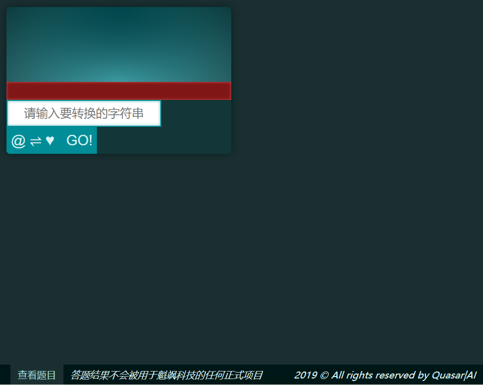
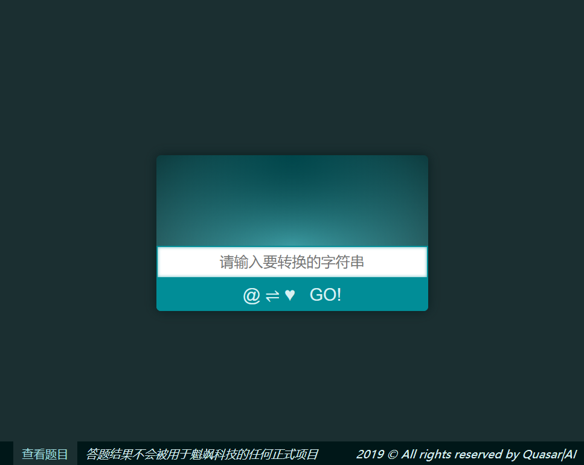
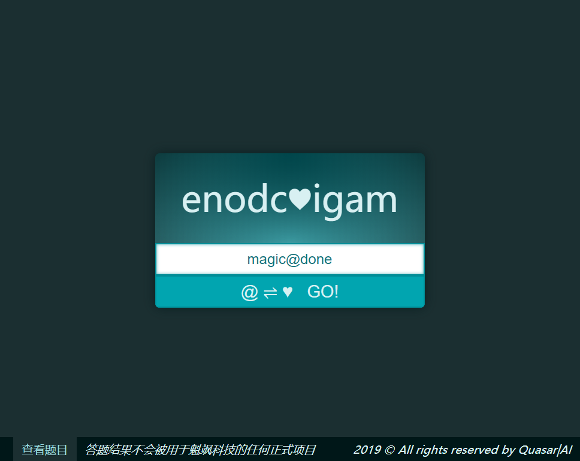

# quiz.h5

## 介绍
QUASAR|AI HTML5前端开发技能水平测试项目

## 题目说明

请在提供的框架基础上，开发一个对字符串进行魔法转换的小工具，能够将字符串倒序处理，并保留其中特殊字符的位置。

本仓库已经提供了项目的开发环境、代码框架和基本的外观样式（颜色、字体等）。所有答题代码均位于`src/app/answer`目录内。请实现`answer.js`和`answer.scss`两个文件中的缺失代码，若有新文件请同样将其放到`src/app/answer`文件夹内。**不允许添加新的npm包依赖。**

请使用JavaScript ES6+和(S)CSS完成题目。时限为1天。

#### 提交方式

题目完成后，请将答案发送到：chen@quasar-ai.com

提交物（2选1）：

- 项目公共仓库URL（GitHub、BitBucket、GitLab、码云均可）
- 将`answer`目录压缩，发送压缩包

## 题目要求

你需要按如下要求实现**界面布局样式**和**算法**两个部分：

- 请准确完成页面布局，按要求完善样式调整
- 高性能的算法会得到更高的评价
- 可以查阅文档资料，但要求独立完成答题

#### 页面布局和样式

启动开发环境后，你会看到如下的页面：



布局和样式完成后，需要得到如下效果：



在输入有效值并提交后，界面显示如下：



输入非法值并提交后，界面显示如下：


主要需要完成的工作有：

- 修改`answer.scss`样式表文件内的各组件样式，按照注释中的要求和提示完成如上图所示的界面布局和样式。
  > 样式表文件使用了SCSS格式，因此支持更丰富的编程特性，如层级嵌套、Mixin、变量引用和依赖导入等。
  > 
  > 如果你对SCSS格式不熟悉，可以直接在SCSS文件内编写原生CSS代码，但我们强烈建议你借这个机会熟悉一下这个流行的CSS扩展，你会发现编写SCSS实在很容易。

- 修改 `answer.js`代码文件内的`AppAnswer.onSuccess()`和`AppAnswer.onError()`两个函数，完成页面的交互逻辑。
  > 你可以添加新的函数、类，或引用新的代码文件。
  >
  > 项目框架中已经对非法输入进行了验证，表单中提交如下的非法数据会调用`AppAnswer.onError()`函数，可用于测试错误信息的显示：
  > 
  > - 空字符串
  > - 非大小写字母、数字和`@`的其他字符

#### 字符串转换逻辑

你需要实现`answer.js`代码文件中的`castSpell()`函数，将输入的字符串倒序，但保留其中特殊字符`@`的位置，并将`@`替换成`♥`。

举例来说，向`castSpell()`函数传入字符串
```
a@bc@defg
```
函数将返回
```
g♥fe♥dcba
```

> 原则上算法可以处理所有有效字符。但为了界面显示效果和错误处理的考核，如上文所述在界面层进行了输入值的验证。在编写`castSpell()`函数时，可以不用考虑上文中的数据验证逻辑。

## 项目结构
项目使用Webpack对代码和资源进行编译和打包。目录和文件结构如下：

```
quiz.h5
    |---- src                       项目源码目录
        |---- app                   App代码目录
            |---- answer            答题代码目录，请在这里完成 <==
            |---- misc              项目使用的杂项代码 (不要修改)
            |---- index.js          入口脚本 (不要修改)
            |---- variables.scss    主题变量，可参考 (不要修改)
        |---- assets                静态资源目录 (不要修改)
```

## 配置开发环境

1. 安装Node环境，推荐使用yarn进行包管理
2. 克隆项目，进入项目目录
3. ``` bash
   # 安装依赖包，在项目目录内执行
   yarn
   # 或   
   npm i
   ```
4. ``` bash
   # 启动开发环境
   npm start
   ```
5. 访问地址`http://localhost:8080/`